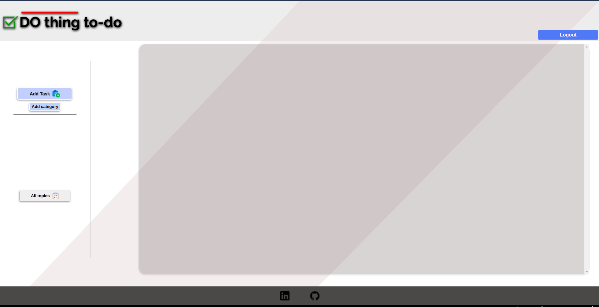
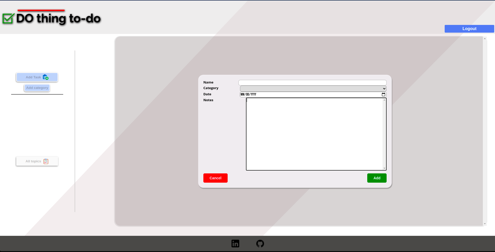
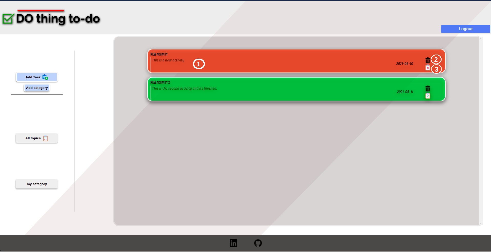

# Do-thig TO-DO :heavy_check_mark:
* [Info:information_source:](## Info)
* [Technologies:computer:](## Technologies)
* [Use:green_circle:](## Use)

## Info 

Hello, I'm Tomas Gomez Belcastro and DO-thing TO-DO is my app project for a to-do list. With Do-thing you can create any new activity you want to remember, incluiding it's due date, name, and any extra info you like. You will be able to delete your activities, update their state to completed or even fit them into categories to search them by topic or all together at once. This activities will be saved into an online data base so you will be capable to login with your Google account from any desktop web browser !. Hope you like it.

## Technologies
For this project I've used different tools and technologies, such as : 

* Vanilla Java script
* HTML 5
* CSS 3
* Webpack
* Firebase
* Sweet alert library
* Eslint
* Prettier

## Use

- First you will have to log-in through your Google account.

- After that you will be able to create a new category for your projects with the "Add category " button: 

- That should open a simple dialog alert where you set your new category name.

- After that you sould see your category displayed as a button on the left nav bar, but before you can use it you will need to add an activity
to that category. You can do it using the "Add Task" button, wich should open a dialog like this one : 

- There you will need to fill at least the first three fields with the task name, category, and due date. After that you have the option to include any exta info on the notes section below and then press the green "add" button.

- Then you can press on your category button on the nav bar to see it's content or the "All Topics" button to bring all of your activities in to display. If I press my new category button after creating any activity I should see something like this : 

-Here you can se 3 numbers: 

* 1 : If you double click the notes of the app you will display an alert with a text area where you can edit the notes of that activity as you like.

* 2 : if you click on the trashcan you will have to confirm you decision to delete that specific activity from your list.

* 3 : if you double click the little task icon you will switch the state of your task from unfunished to finished or viceversa.

